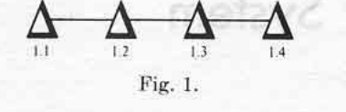
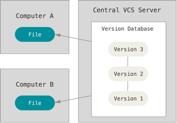
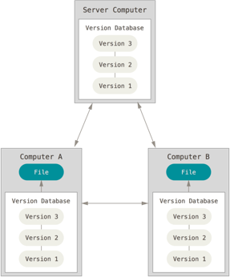

# Notes (Theory)

[[toc]]

 # What is Workflow

- You can think of a workflow as a systematic approach to doing repetitive tasks

- The term 'workflow' has roots in 1920s manufacturing and the need for orchestrating efficient ways to get repetitive tasks done

- Programmers have adopted this idea of workflow and the term is commonly used. Whilst programming is a highly creative undertaking we can not ignore the fact that there are many repetitive tasks 

- If these tasks are approached systematically they can easily be automated

<cite> Figure 1 - Web Technologies Recommended Workflow </cite>

- Figure 1 is a diagrammatic representation of the high level workflow we'll use on this course 

	- Work is created locally 
	- [HTML is validated using the W3C](https://validator.w3.org/ validator)
	- [At the end of each session the work is pushed up to GITHub](https://github.com/)

- I am sure at this stage many of the above terms may well appear somewhat alien and that's ok. I just want you to understand the idea of workflow and that Figure 1 is an abstract representation of the the given workflow for this unit.  In due time the more granular details will become clear

## What is Version Control

- Version control is simply a workflow that involves keeping historic versions of our work. In fact you may well have already implemented your own version control system by keeping multiple versions of your work in different folders (see Figure 2)

<cite> Figure 2 - A Manual Version Control Workflow </cite>

- The above method is very ineffective! Firstly, we don't know exactly what has changed in each version. Secondly, we may accidentally write to the wrong folder or forget entirely to make our backups

- Version Control Systems (VCS) automate the process of controlling versions our work. The first VCS was developed by Marc Rochkind in 1975 while working at Bell Labs ({{"Rochkind1975" | citeNoBraces}})

<cite> Figure 3 - Changes Graph </cite>

- Rockind proposed that rather than keeping full duplicates of the project we should only keep copies of the changes. These changes are linked together in a graph/tree like structure. Firstly, this significantly saves on space (which was a  premium at the time) as we only store our changes and not complete versions of our work. Secondly, having the changes in a graph like structure allows navigation of the graph and the ability to roll our work back or 

- One of the first widely used VCS was RCS **(insert citation)**. Developers would **check files into the RCS** to put them under version control. When a developer wanted to work on a given file that specific file would be individually **checked out** to work on. Changes are logged in a graph like structure proposed by Rockind.

  ## Distributed Vs Centralised Version Control
  
  
  - So far we've only looked at VCSs that keep a revision history on the developers local computer. Perhaps you've already considered some the glaring issues! 
  
   - **What happens if your local computer goes down?** 
   - **How do we collaborated with other developers on the same project?**
  
  
  
  ## Centralised version control
  
  
   
   
  
   <cite>Figure 4 - Centralised Version Control  </cite>
  
   
  - The first proposed solution to the above problem was to place the VCS on a centralised server (see Figure 4). Developers would check out individual files and work on them locally. After making changes they would check the file back into the remote server. While this configuration allows collaboration it still has the major downside that the entire project is kept in a single location. A single location of course means exposure to a single point of failure.  
  
  ## Distributed version control 
  
  
   
   
  
   <cite>Figure 5 - Distributed Version Control  </cite>
  
  - A distributed version control system such as GIT solves the aforementioned problems. In such systems developers don't just check out single files or the latest snap shot of the project rather they fully mirror the project and all of its revisions. Should the server or any other computer die, then anyone who's working on the project has a full history. 
  
  
  # Introduction GIT
  
  
  
  
  
  
  - GIT is a widely used free decentralised VCS (DVCS)
  
  
  -  Its history can be traced back to the origins of the Linux kernel open source project. Between 1991 and 2002 changes in the project were shared between developers by emailing around patches. 
  
  - In 2002 Linus Trovalds the founder of the linux project placed it under version control using the  free DVCS system BitKeeper.
  
  - In 2005 BitKeeper put up a pay wall, the software was no longer free. This prompted Linus Torvalds to create his own DCVS
  
  >> **Interesting Point:** Linus named his VCS GIT as a slight at the former BitKeeper team, specifically Larry McCoy
  
  
  # Version Control Using Git
  
  - Recall that early VCSs tracked the changes in files storing them in 
  a graph like structure. 
  
  - GIT differs from traditional version control systems in that it stores an  entire copy of files as they change. It's in effect an automation to the manual process of manually duplicating the project and storing it in multiple folders.
  
  - As we have a complete history of our files over time. GIT allows us to make changes without worrying if we break things. We can simply roll back to earlier versions of our work. 
   
   
   ## GIT Workflow
  
   
   
   
   <cite> Figure 6 - A Simple Git Workflow </cite>
  
   
   
  - Figure 6 is a visual representation of a simple git workflow. 
  
         - One or more files are firstly staged for commit 
         - Once the commit is ready a snap shot is taken in the form of a `commit` . A programmer defined message is attached to the commit describing the changes
         - That's it! It really is that simple at least to start with. For now just be aware that you can recover historic versions of your work. However, to keep things simple we won't be looking into file recovery until later in the unit. What's key at this point is you become comfortable with the basic GIT workflow. 

  
  ## Git Remote Repositories
  
  - One of the true powers of working with GIT is the ability to distribute your work to a remote GIT server
  - There are a couple of reasons why this is useful:
      - It allows for easy collaboration with others programmers 
      - Your work is always backed up 
  
  
  ## The GIT Server
  
  - [While it is possible to set up your own git server.](https://git-scm.com/book/en/v2/Git-on-the-Server-Setting-Up-the-Server) Most people opt for a  preconfigured hosted git server.
  
  - [www.github.com](www.gihub.com) is one of the the most popular remote host and our choice for this unit.
  
   
  
  
  - [GITHub](https://github.com/about) at the time of writing has more than 27 million members who have collectively created 80 million repositories. 
  - While GitHub is primarily marketed towards development teams it is nonetheless an excellent tool to use as an individual programmer.
  - You can think of it as the ultimate cloud storage for your programming work. 
  
    
  >> TIP Ensure your sign up for a GITHub student pack to get among other things free private repositories [https://education.github.com/pack]()

