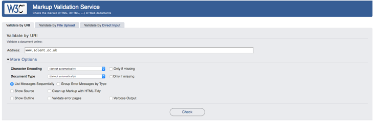

 # Notes (Theory)
 
 
 ## The Origins Of The World Wide Web 

 - In order better understand the idea of content rights and how html pages exist on the web. It is useful to consider how content came to be on the world wide web to begin with


<cite> Tim Berners-Lee Inventor of the World Wide Web </cite>

>> "Suppose all the information stored on computers everywhere were linked"
(Berners 2001, p.4)

- What's interesting is the origins of the world wide web can be traced back to a single individual Tim Berners-Lee


<cite> Figure 8 - The Large Hadron Collider </cite>


- In the mid 80's to early 90's Tim Beners-Lee was working at CERN, home of the particle accelerator the Large Hadron Collider 
- CERN is a huge collaborative international research project consisting of a steady stream of researchers coming and going at any given time 
- Often when a group of scientist left often much of their unpublished work was undiscoverable 
- [In 1989 Beners-Lee proposed a hypertext system that would sit on top of the internet](https://www.w3.org/History/1989/proposal.html) . His idea was to define a set technologies to allow computers running on different operating systems to communicate in a decent fashion. The system consisted of of the following primary technologies:


>> a "web" of notes with links (like references) between them is far more useful than a fixed hierarchical system.  (Berners-Lee 1989)


  - A Universal Resource Locator (URL) to identify resources
  - Hyper Text Markup Language (HTML) to represent HTML documents 
  - Hyper Text Transfer Protocol (HTTP)
  - [A Hyper Text server implementing HTTP](https://www.w3.org/Daemon/)


-  [In 1993 the development the first Mosaic](https://github.com/alandipert/ncsa-mosaic) the first graphical web browser popularised the Word Wide Web

- [In 1994  Tim Berners-Lee founded the World Wide Web Consortium (W3C) which maintains web standards](https://www.w3.org/standards/)

## Validating your HTML


<cite> [https://validator.w3.org/](https://validator.w3.org/#validate_by_uri+with_options) - Validating your HTML is a simple undertaking </cite>

- As discussed above, HTML is a standard laid down by the W3C. As such, it is important that we uphold this standard. Not only is it considered good practice, you will also be required to submit valid HTML for your **assessments**

- Luckily, the W3C provides a validator we can use (see image above). You just simply provide a link, or directly input you html (probably the easiest way). If you check the validity of your work regularly then, soon, before you know it, you will be writing valid HTML without thinking.  


## Where Do Websites Live


- On the whole, web sites and web applications do not  live on your computer
- The reason I say **on the whole** is now using technologies such as electron and 
  react native script use web technologies to create desktop an mobile applications
  However, to begin with we'll focus on the more traditional web architecture 
- There is a concept of `front end` and `back end`
- Pages and resources are fetched via the Hyper(H) Text(T) Transfer(T) Protocol(P) and sent from server to your local computer
- URL's are resolved to a IP address via the use of a DNS server

```
:authority: www.google.co.uk
:method: GET
:path: /
:scheme: https

```
>> An HTTP request header

### Front End 

- When developers refer to the `front end` of a website the usually mean the `HTML/CSS/JavaScript` used to display the visual elements of a page 

### Back End 

- The `back end` refers to the functionality that lives on the web s server. Common server side languages are `Python`, `PHP` and `RUBY`.


 
 ## Ownership 
 
 ### Copyright and Licensing 
 
 
 - We've determined that web content is downloaded to your computer. However, it's important to understand that you don't own the rights to that content 
 
 - The creator of that content which can be a company or individual/s owns the exclusive writes to that work  as soon as it is created
   
 - The copyright lasts for 70 years after the creators death
 
 - Copyright owners can grant grant others use of their work. Rather than do this on an 
 individual basis often general licenses are issued
 
 
 ### Creative Commons 
 
 
 >> Creative Commons helps you legally share your knowledge and 
 creativity to build a more equitable, accessible, and innovative world. 
 We unlock the full potential of the internet to drive a new era of development, 
 growth and productivity.
 
 - Lawrence Lessig founded Creative Commons (CC) in 2001 to create a 
   series of easy-to-understand copyright licenses for online creative work. 
   These licenses established the notion of “some rights reserved.” This allows creatives to share their work and apply certain restrictions at the same time
 
 - Check out [https://choosealicense.com/](https://choosealicense.com/) get an idea of the different types of licenses you can you for your own work
 
 
 - [https://search.creativecommons.org/](https://search.creativecommons.org/) allows you to search for free image resources. You should use this to find content for your websites
 
