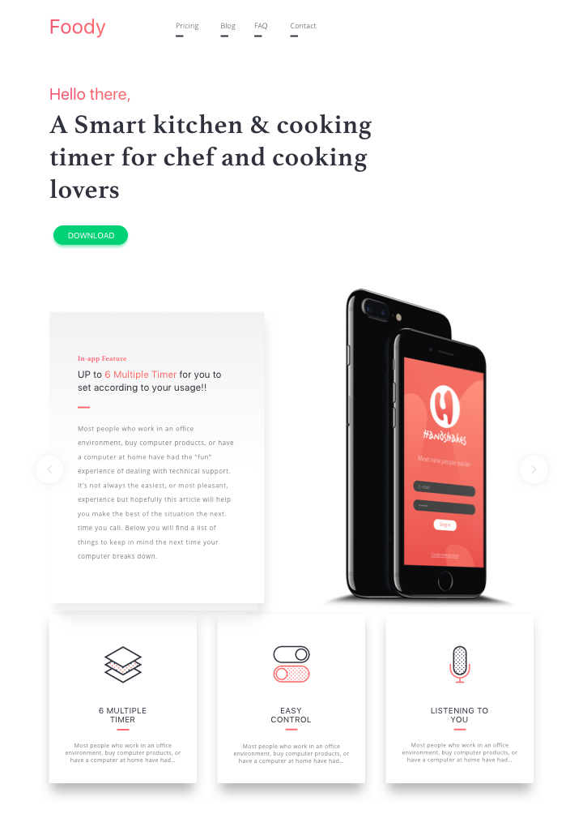

# Practical

Remember when to continue your work flow

- Make regular commits 
  - `git add -A `
  - `git commit -m 'commit message'`

- At the end of the session, upload to github
  - `git push origin master`  

### Laying out a website

This week we're introducing the concept of cascading styles sheets (CSS). 

## Task 1

The first part of the practical introduces you to the basics of laying out websites. 

<iframe width="560" height="315" src="https://www.youtube.com/embed/BB0R9CL4DyQ" frameborder="0" allow="autoplay; encrypted-media" allowfullscreen></iframe>

Make sure your HTML is valid using the W3C validator. [https://validator.w3.org/](https://validator.w3.org/).  

## Task 2

>> The food landing page, this is just for reference. Use mock_up_start_here.png as as your main guide 

- This is going to be a larger extended project which will have to be completed over the course of the week.

- Using the notes below, you are going to work out how to lay out the Foody landing page. 

- <a href="https://github.com/joeappleton18/web_technologies_notes/raw/master/blocks/section1/2_the_web_what_it_is_who_owns_it/assets/web_project.zip" download>Download the detailed mock up </a>

- Using external CSS implement the mock up to the best of your ability. 
