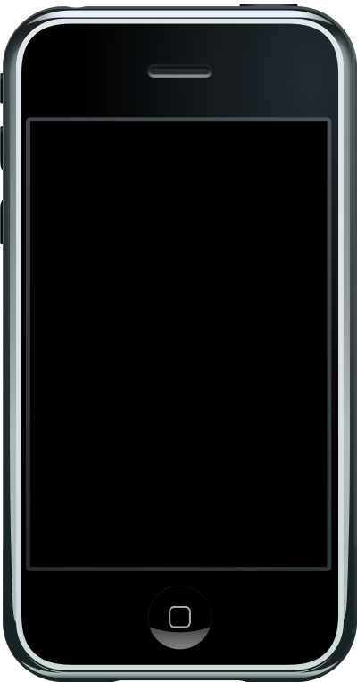

# Notes (Theory)

## The evolution of mobile website access

 Recall from last weeks lecture, the World Wide Web Consortium (W3C) was formed in 1994. Of course, back then, there was no concept of a smart phones. Web developers could be confident in the knowledge that users would only accessing their content via a desktop view. 

## WAP 

In theory, the WWW has been accessible on mobile devices in the form of WAP.  However, WAP sites were considered a clunky novelty, never really garnering mainstream adaptation. A paper commenting on [WAP](http://waptrick.com/en/song-lyrics/showartistsbyletter.jsp?c=B) in 2001:

>>  The entrepreneurial push
   remains limited, and applications are developing slowly both in quality and quantity (Rangone, 2002)[https://pdfs.semanticscholar.org/a491/0b8fd568bda4ebc886da5eb91069236ec9f5.pdf]

###  The release of the first smart phone


>> The first generation iphone (https://youtu.be/vN4U5FqrOdQ?t=2489 )

It was not until relatively recently, 2007, that the first smart phone was released. If you watch the above video, you will see that while a the apple phone allowed web browsing, accessing a desktop site via a mobile was hardly user friendly.

### The Tipping Point 

 In 2014 more users accessed the internet from their mobile devices than desktop. Today, we simply can not afford to not support devices of all sizes. This is where responsive design comes into play. It is an approach that allows the website to naturally adapt based on the device you are viewing it on. 
 
 ## Responsive Design 


While there are three main responsive tenants that you should be aware of:

- Fluid Grids
- Responsive Images 
- Media Queries 

In this unit, due to time constraints, we will only focus on responsive images and media queries.   Both of these concepts shall be introduced below. But first we will consider the ideas of viewport and breakpoints. These are concepts as opposed to methods. They are, however, important for understanding responsive design 


## View Port 


>> Desktop View 


>> Mobile View - The content is very small

When it comes to mobile devices things are't quite as simple. Typically on a mobile, the viewport is set larger than the device, next entire view is scaled down to fit the device. This ensures the entire page is shown, the problem with this is the content will become very small.


With regards to responsive design, we don't want the viewport to be scaled down. Luckily, using the below tag we can set the view port relative to the width of the device:

```<meta name="viewport" content="width=device-width, initial-scale=1">```


## Breakpoints 


>> Notice on the smaller view of smashingmagazine.com on the left a breakpoint is triggered and the menu is removed

A breakpoint is the point at which a website changes layout based on the width of the viewport. Since, when we are developing responsively, we set the viewport equal to the width of the device, using pixels we can easily target device sizes. This is where media queries come in.

### Media Queries 

Media queries can be used to target different device widths. 

```html 
/* Extra small devices (phones, 600px and down) */
@media only screen and (max-width: 600px) {...} 

/* Small devices (portrait tablets and large phones, 600px and up) */
@media only screen and (min-width: 600px) {...} 

/* Medium devices (landscape tablets, 768px and up) */
@media only screen and (min-width: 768px) {...} 

/* Large devices (laptops/desktops, 992px and up) */
@media only screen and (min-width: 992px) {...} 

/* Extra large devices (large laptops and desktops, 1200px and up) */
@media only screen and (min-width: 1200px) {...}
```

The the html within each of the media queries curly brackets `{}` will only be applied when the viewport condition is met. In the practical notes we will look at how we can take advantage of the viewport to lay out a responsive website. 

### Responsive  images 

Making images responsive is simple, the max-width property can simply be used in your css. This will ensure that images correctly resize. 
 ```
 img {
 max-width: 100%;
 }
 ```

## Testing Responsive Websites 

In order to test responsive websites we need to view the site trough a variety of different devices. Although using actual different physical devices is a legitimate test strategy, taking such an approach in our day to day development workflow is not feasible.

Chrome developer tools offers a handy bit of functionality that allows us to emulate different devices.


- Simply right click on the website you want to test and select inspect element
 - Click the device emulator
 - Elect which device you want to emulate from the drop down that will appear at the top of the screen
