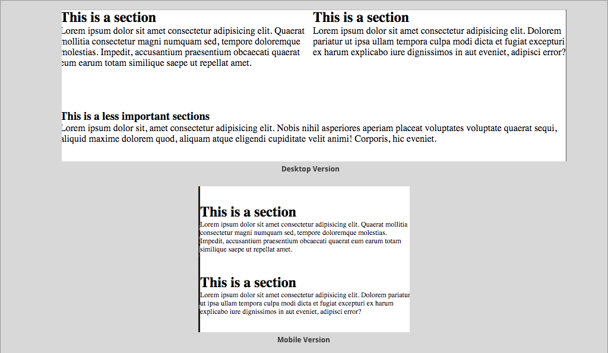

# Notes (Practical)

## Laying out responsive websites

Media queries form one of the foundations of responsive design. They allow us to create breakpoints that change the look and feel of our websites based on the device size that it's being viewed on.

In order to effectively use media queries, we nee to make sure that the viewport is representative of the device width. We can achieve this by using the viewport meta tag:

```<meta name="viewport" content="width=device-width, initial-scale=1">```


``@media (query) {
  /* we can then place rules in here */
}``

As mentioned above we place our media queries in directly in the style sheet. Consider the following example:

```
body {

  background-color:green;

}

@media(max-width:500px) {
  body {
     background-color:yellow;
  }

}
```

- The resulting outcome of the above media query is the background colour of our website will change to yellow when the viewport is smaller than or equal to 500px
  
 - We can have multiple media queries in one CSS file to target different device sizes. Below are some common device sizes that we may want to target:
 
 ```html
 
  /* Custom, iPhone Retina */ 
     @media (max-width : 320px) {
 
     }
 
     /* Extra Small Devices, Phones */ 
     @media (max-width : 480px) {
 
     }
 
     /* Small Devices, Tablets */
     @media (max-width : 768px) {
 
     }
 
     /* Medium Devices, Desktops */
     @media (max-width : 992px) {
 
     }
 
     /* Large Devices, Wide Screens */
     @media (max-width : 1200px) {
 
     }

```
A complete responsive website example 



```
<div class="wrapper">

      <section class="left">
        <h2> This is a section </h2>
        <p>Lorem ipsum dolor sit amet consectetur adipisicing elit. Quaerat mollitia consectetur magni numquam sed, tempore doloremque molestias. Impedit, accusantium praesentium obcaecati quaerat eum earum totam similique saepe ut repellat amet.</p>
      </section>
      <section class="right">

        <h2>This is a section</h2>
        <p> ...</p>

      </section>

      <div class="bottom-section">

        <h3> This is a less important sections</h3>
        <p> ...</p>

      </div> 
      <!-- ./bottom-section -->   
</div>
<!-- /.wrapper -->

```
**CSS**

```html
* {
  margin: 0%;
  padding: 0%
}

.wrapper {
  overflow: auto;
}

.left, .right {
  float: left;
  width: 50%;
}

.bottom-section {
  margin-top: 20%;
  width: 100%;
}


@media (max-width : 400px) {
    .bottom-section {
        display: none;
    }

  .left, .right {
         margin-top: 10%;
         float: left;
         width: 100%;
   } 

  p {
    font-size: 12px;
  }

}
```

The above example demonstrates a very simple responsive website
We can get much more advanced, but for the purpose of this course you will only be required to work with one breakpoint.
In this case, we have set a breakpoint of `@media (max-width : 400px)`. The rules within this section will only be applied for devices with a viewport smaller than `400px`
Notice how we can remove sections by using `display: none;` this is a common approach


