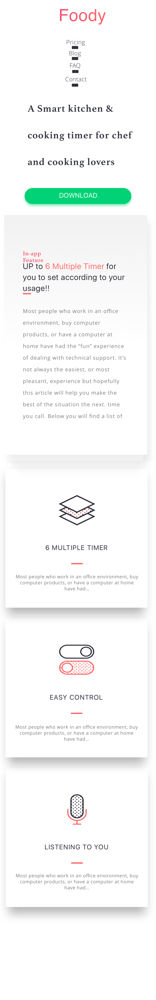

# Practical 

## Task 1

<iframe width="700" height="394" src="https://www.youtube.com/embed/hR9eDirLcpU" frameborder="0" allow="accelerometer; autoplay; encrypted-media; gyroscope; picture-in-picture" allowfullscreen></iframe>

## Task 2 

You are required to make a responsive website that resembles the mock up below

- Do not forget add the `<meta name="viewport" content="width=device-width, initial-scale=1">` tag in the header

- We will only have one breakpoint which will be triggered
  `@media (max-width : 400px) { }`
  
 ### Setup 
 
 - The style guides and mockups should be downloaded from [here](https://github.com/joeappleton18/cda400_2017/raw/gh-pages/sessions/week11/task.zip)
 
 - The assets for the project should be downloaded from [here](https://github.com/joeappleton18/cda400_2017/raw/gh-pages/sessions/week11/web_assets.zip)
   

## Task 3

- At this juncture you should have laid out the foodie website. If you have not done this re-visit the task from week 2.

- We are now going to make this website responsive. Use a single breakpoint of 'max-width: 700px', anything below this width should be considered a mobile device. The image below will give you an idea of what we are trying to achieve. Notice how we are hiding unimportant elements such as the phone image.

