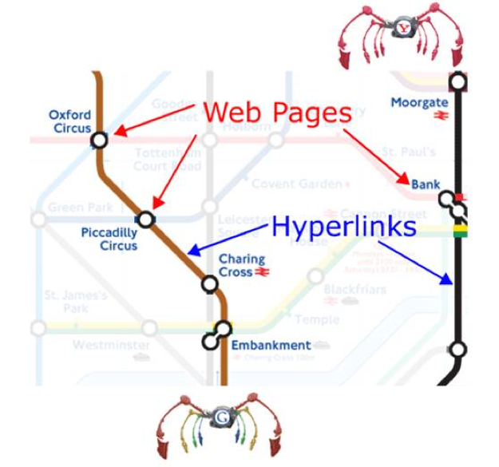
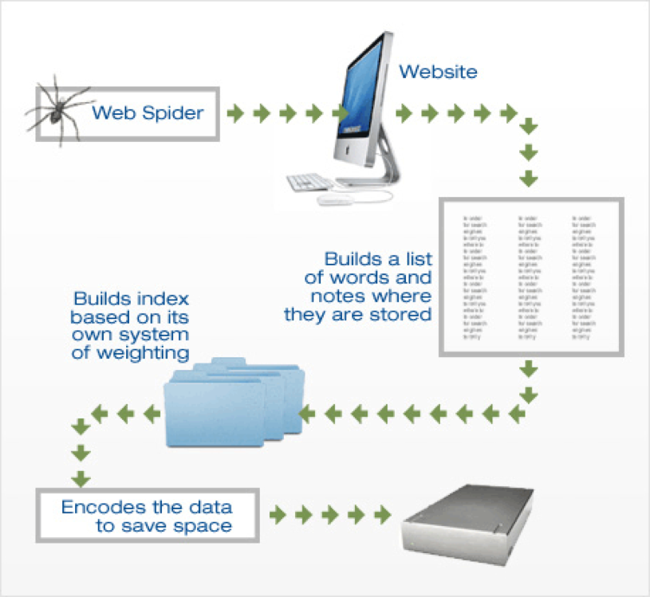
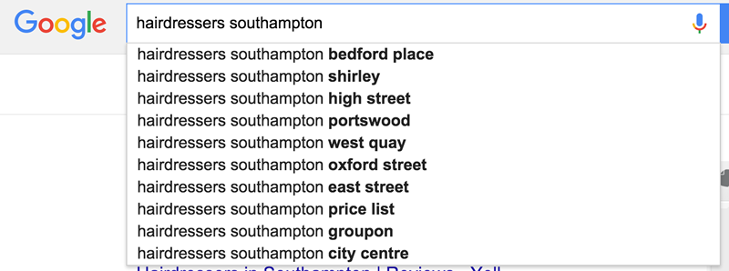
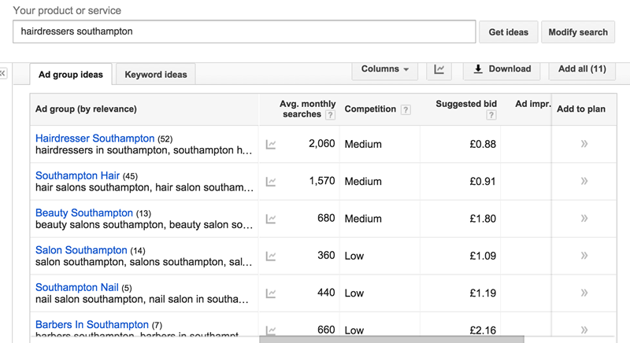

# Notes (Theory)


## How Search Engines Work

A search engine is an Internet-based tool that searches an index of documents for a particular term, phrase or text specified by the user.


 


* Spider “crawls” the web to find new documents (web pages) by following hyperlinks from websites already in their database
* Search engines index the content (text, code) by adding it to their databases 
* Search engines search their own databases when a user enters a search to find related documents …
* Search engines rank the resulting documents using an algorithm by assigning various weights and ranking factors. The algorithms are secret, however it's widely know that, the following are key ranking factors:
	
	*  Website quality 
	*  Page authority — how many external sites are linking to the website in question 

 
*http://myblogranksfirstingoogle.blogspot.co.uk/2010/09/work-flow-of-search-engines.html*

### Current UK Search Engine Market Share


|Search Engine | March 2015 Market Share |
|--------------|-------------------------|
| Google		  | 88%		|
| Bing 		  | 6.7%		|				
| Yahoo		  | 3.54%    |


## Search Engine Optimisation (SEO) 


* Process of improving the visibility of a web site via the “free/natural” listings
* SEO affects only organic search results, not paid or "sponsored" results
* Common characteristic: find matching documents & display them according to relevance
* SEO practices can be split into two categories **on-page** and **off-page**


### On-page SEO

On-page SEO is the act of optimising different parts of your web site that affect your search engine rankings.

### Off-page SEO

Off-Page SEO focuses on increasing the **authority** of a website by building links and attracting social media interest. These activities occur external to your,  website, hence the name "Off-page SEO".  

**You need to consider both on and off page optimisation when creating a website**


## On-Page SEO 
On-page SEO is essentially best practices that you should follow when creating HTML pages. Unlike Off-Page SEO, everything is directly under your control, so it's very easy to implement.   


### Page Title

 * Create Unique & Accurate Page Titles
 * `<title>` tag tells users & search engines what the topic of a particular page is

 * **Bad** does not in any way describes the page content
 	
 		<title> Home </title>
 		
 * **Good** Accurately describes the page's content   
		
	    <title> Brandon's Baseball Cards - Buy Cars, Baseball News, Card Prices </title>
* Title contents are displayed in search results


* Create **unique** title tags for each page


### Meta Tags 

* `<meta>` tags contain information about the web page 

* Description: used by search engines to provide a short summary of the page

		<meta name="description" content="Free Web tutorials"/>


### URL Structure

* Navigation is very important for search engines
* Plan out navigation based on the homepage
* Put an HTML site map up and link to it from the home page

 

### Internal Links

Your internal links should use descriptive anchor text. Anchor text is the text between the two `<a>` tags. 

**bad**
	
	`<a href="tutorial.html"> Tutorial </a>` 
	
**good**

	`<a href="tutorial.html"> Beginners SEO Tutorial </a>` 
	
	
###  Content 

Your HTML pages should be well structured and meaningful, consider the following:  

* Each page should have a unique `<h1>` tag
* All content should be well written and easy to follow
* All images should have a descriptive `alt` attribute 
		
		 google.jpg </img> 


## Off-Page SEO 

As mentioned, off-page SEO is in general about building inbound links to your website. Inbound links are also know as **back links**

### Inbound Links are A Vote

An inbound link is a link from an external website that points to your website.  **Search engines** view a link as a vote of confidence for your website. **A websites ranking**, is often proportional to the amount of inbound links. 
 
### Not all Links Are Created Equal 

**Building** links is thought to have the greatest effect out of any SEO activity, when it comes to climbing the search rankings. However, not all inbound links are considered equal. 

Higher quality inbound links will yield better results. It's thought the following effects link quality:

* The trustworthiness of the linking domain
* The popularity of the linking page
* The relevancy of the content between the source page and the target page
* The anchor text used in the link
* The amount of links to the same page on the source page
* The amount of domains that link to the target page
* The amount of variations that are used as anchor text to links to the target page
* The ownership relationship between the source and target domains

- [https://moz.com/learn/seo/external-link](https://moz.com/learn/seo/external-link)


### Popular Link Building Techniques 

There are many different methods for building inbound links. A few common methods are:

 **Social Profiles -**
  When you create social media profiles for your website (Twitter, Facebook, YouTube e.t.c) there's normally a section in the profile page to  include a link to your website

**Guest Articles - Many websites are open to guest article writers. In return for your efforts they'll allow you to link back to your website within the article**

**Creating Compelling Link Worthy Content**  You should always aim to create compelling content on your website. In doing so people are more likely to share your content on social media and also link back to you  
- [http://pointblankseo.com/link-building-strategies](http://pointblankseo.com/link-building-strategies)


## Keyword and Competitor Research

### Understanding Key Words 

Keywords are the search terms that we want our website to rank in the search results for. 
The first stage of performing SEO on our website is determining which keywords we want to target.  However, not all keywords are created equal:

A good quality keyword will:

* Have a reasonable search volume
* A low number of competitor sites trying to optimise for the key word

### Case Study - A Southampton Hairdressing Company  
Imagine you're creating a website for a hairdressing firm. Let's consider the typical SEO process that would be undertaken.

### Finding Prospective Keywords
Firstly we need to find a list of prospective keywords that we may want to target. Google is a great place to start, we can simply enter an obvious keyword, such as  "Southampton Hairdressers" and take a note of it's suggested search terms. This can serve as a seed list of keywords. 



### Determining Keyword Search Volume

Next we need to determine the search volume for each of these keywords.  We can use the Google Keyword Tool to achieve this. This tool will also give you further keyword suggestions and a rough idea of how competitive the keyword is: [https://adwords.google.co.uk/KeywordPlanner](https://adwords.google.co.uk/KeywordPlanner)



Now we have a prospective keyword list.  We can now create content on the website with these keywords in mind. 
 

## Social Media 

Social media needs to play a huge part in any websites marketing strategy:

* Making your site appear compelling over social media can massively increase your potential customer base 
* It's possible to control visually how your site appears when it's shared
* You can in effect create an advert for your website


### Facebook Open Graph Tags	

You can use Facebook's Open Graph tags to take control over how your content appears when it's shared on Facebook. They're implemented as an attribute within  `<meta>` tags. 

	 <head>
		<meta property="og:title" content="Title Here" />
		<meta property="og:type" content="article" />
		<meta property="og:url" content="http://www.example.com/" />
		<meta property="og:image" content="http://example.com/image.jpg" />
		<meta property="og:description" content="Description Here" />
	</head>	

	
![opengraph][./assets/open-graph-code-facebook.jpg)

	
### Twitter cards 

Similar to open graph, Twitter lets you control how your website is displayed using something called a Twitter card. Just like Open graph, the information is implemented as an attribute within your pages `<meta>` tags. 

 ```html  
    <head>
    	<!-- Twitter Card data -->
    	<meta name="twitter:card" content="summary">
    	<meta name="twitter:site" content="@publisher_handle">
    	<meta name="twitter:title" content="Page Title">
    	<meta name="twitter:description" content="Page description less than 200 characters">
    	<meta name="twitter:creator" content="@author_handle">
    	<-- Twitter Summary card images must be at least 120x120px -->
    	<meta name="twitter:image" content="http://www.example.com/image.jpg">
    </head>

```


