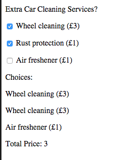

# Notes (Practical)

## External JavaScript 

Up to this juncture we have have been placing our JavaScript internally within out `<html>` document. While this works for small experimentations it is not considered best practice as we are mixing programming logic with document presentation. To separate these concerns we can use external JavaScript:

### Including javaScript in an external file

Just like with CSS it's considered good practice to separate the javaScript code from our HTML. The `<script>` tag allows us to utilise the src attribute to include javaScript contained in an external file. The following conventions must be adhered to:

- The external file should have a .js extension
- You do not need to use the `<script>` tag in the external `.js` file
>> Below we include `demo_script_src.js` which lives in the scripts folder


## Conditional Statements

In order to code decisions into our javaScript programs it's necessary to use conditional statements know as `if` statements.

An `if` statement is a  
conditional statement which checks to see if a statement is `true`  
or `false` and then executes some additional statements depending  
on the result.

In javaScript a basic IF statement looks as follows:

```javascript
if (condition) { 
    //code to be executed if condition is true 
}
```

**A real example**

```javascript
//check if the statement 5 > 3 is true and if so
//then print a suitable message
    if (5 > 3){
        console.log("It is bigger!"); 
   }
```

We can also specify an alternative by using an `else` as follows:

```javascript
if (5 > 3){
        console.log("It is bigger!"); 
}else {
        console.log("It is smaller");

}
```

The bigger than symbol `>` is know as a comparison operator.  You may want to make use of the following operators:


|Operator | Description |
|---------|  -----------|
|==|equal to|
|!=|not equal|
|>|greater than|
|<| 	less than|
|>=|greater than or equal to|
|<=|less than or equal to||


 

We can only have 1 else with every if. If we want to specify more than one alternative then we have to use `else if`.

Consider the following example:

```
if (role == "Teacher"){

    console.log("You are a teacher!");

}

else if (role == "Student"){

    console.log("You are a student!");

}

else if (role == "Admin"){

    console.log("Your are an admin");

}

else{

     console.log("I don’t know what you are!");

}

```

In the above example you will notice that an `else if` statement is used  
to specify alternative paths and that you can have more than 1 `else if`  statement. In fact, you can have as many `else if` statements as you like.


### Multiple conditions

 You can join together different conditions with "or” or “and” statements, to test whether either statement is true, or both are true, respectively.

In JavaScript “or” is written as `||` and “and” is written as `&&`.

Say you want to test if the value of x is between 10 and 20—you could do that with a condition stating:

```
if(x > 10 && x < 20) {
    ...
}
```

If you want to make sure that country is either “England” or “Germany” you use:

```
if(country === 'England' || country === 'Germany') {
    ...
}
```


## Adding Event Listeners

Although we've not formally introduced the concept, we've already used javaScript event driven capabilities. Remember this bit of code:

**The HTML**

```html
<p> <button onClick="showName()">Click Me</button> </p>
```

**The JavaScript**

```html 
function showName(){
    // insert instructions    
} //end function
```

In the above example we're listening for a click event via the implementation of `onClick="showName()` attribute. The browser will then invoke the function `showName()` when the click event occurs. Functions that react to events are known as event handlers.

## JavaScript Events 

So far, we've only looked at one event, onClick. There are however many different events that we can react to. Here are some of the most common:

- `onchange` - An HTML element has been changed . E.G. a form has been updated
- `onclick` - The user clicks an HTML element
- `onmouseover` - 	The user moves the mouse over an HTML element
- `onmouseout` - The user moves the mouse away from an HTML element
- `onkeydown` - The user pushes a keyboard key
- `onload`  - The user pushes a keyboard key

## Adding Event Listeners 

There are two main ways to add event listeners: 

* Using an inline attribute to add a call back function (up to this point how we've added event listeners)
* Adding an the event listener using javaScript 

Just like with HTML we want to, where possible, avoid the use of inline elements. Therefore, in most cases it's advantageous to add event listeners using javaScript. 

We've seen the below example before, however we're now adding the callback using javaScript and also using an external .js file

>> demo.html

```html
<html>
	<head>
        <script type="text/javascript" src="scripts/event_demo.js">  </script>    	
	</head>
	<!-- we use onload here to initiate our program --> 
    <body onload="main()">
    		<input  id="userName" type = "text" placeholder = "Enter Name">
			<!-- An event listener will be added to the button using javaScript --> 
            <button id="button"> Click Me </button>	
            <p id = "output"><!-- result will be placed here --> </p>
	</body>

</html>

```

>> scripts/event_demo.js

```javascript
/**
    Main Function is invoked when the html 
    page has loaded

**/
function main() {
    //reference an html element 
    var myButton = document.getElementById("button");
     //myButton holds a reference to our button element 
    //we can now add a on click event 
    myButton.addEventListener("click", buttonClicked)
    
}

/**
  buttonClicked call back function 
**/

function buttonClicked() {
   //get the value entered into the user name     
   var myUserName = document.getElementById("userName").value 
   //ouput to our p tag 
   document.getElementById("output").innerHTML = "Hello " + myUserName;
}

```


In the above example notice how clean our HTML is. The only inline event listener we add is `<body onload="main()">` this effectively initiates our program when the document has loaded. Also **note** when we set up an event listener using javascript we can omit  the "on" for the event name. 

 ```html
 myButton.addEventListener("click", buttonClicked)  //onclick becomes click
 ```

## Loops in javaScript
Loops are a fundamental concept in computer programming. They allow us to repeat a set of one or more instructions a desired number of times. 

Consider a simple javaScript program where we log "Solent University" to the console 5 times. You may take the following approach in solving this problem:  

```html
	console.log("Solent University"); 
	console.log("Solent University"); 
	console.log("Solent University"); 
	console.log("Solent University"); 
	console.log("Solent University");   
```

The above approach works when we have to repeat an instruction a small number of times. However, as the number of times you have to repeat the same instruction or set of instructions increases, this approach becomes increasingly unfeasible. What if we now had to print run the instruction 1,000 times or even 1,000,000 times. In order to approach problems like these we need to utilise loops. 

The two main types of loops that we'll user are:

 * **for loops** - used for a set number of iterations
 *	**while loop** - used when a certain condition is


### The While Loop

Used when a certain condition is true 

```javascript
    
    while (condition) {
    	code block to be executed
    }
```

>> Syntax 
 

```javascript
	var i=0;  
	while (i < 5)
	{
  		console.log("Solent University");
  		i++;
	}
```
>> Example
	


### The For Loop

**Used for a set number of iterations**

```javascript 

	for (var i=startvalue; i<endvalue; i=i+increment)
	{
			  // code to be executed
	}
```

>> Syntax


```javascript
	
	for (var i=0; i<5; i++)
	{
		consoel.log(“Solent University");
		
	}

```

>> Example


## Using a for loop to process check boxes 

A useful practical application of a for loop in javaScript is to iterate through check boxes. Given that a checkbox has multiple inputs and potentially multiple selections, we can't just access the selected values like we would for a single form input element. 


Consider the following form:

```html
	<form  id="carRental">
            <p>Extra Car Cleaning Services?</p>    
            <p><input type="checkbox" name="extras" value="wheelCleaning"> Wheel cleaning (£3) </p>
            <p><input type="checkbox" name="extras" value="rustProtection">  Rust protection (£2) </p>
            <p><input type="checkbox" name="extras" value="airFreshner">  Air freshener (£1) </p>
    </form>
```

>> HTML


Below is how we would access each of the checkbox inputs values. 

```javascript

	 var form  = document.getElementById("carRental");
    
     for(var i = 0; i < form.extras.length; i++) {
         if (form.extras[i].checked){
            //this block of code is executed 
            console.log("You selected" + form.extras[i].value);  
         }
     }

```

In the above example, we loop through our checkbox group and simply print out the **value** attribute if the checkbox has been selected. 


**Note**  `form.extras.length` returns the number of elements in our checkbox group, in this case it would be `3`. 


## The onChange Event

The `onChange` event is particularly useful when it's applied to a form. This event will fire whenever a form is updated. 


It's implemented as follows:


```html
	<form  id="carRental">
            <p>Extra Car Cleaning Services?</p>    
            <p><input type="checkbox" name="extras" value="wheelCleaning"> Wheel cleaning (£3) </p>
            <p><input type="checkbox" name="extras" value="rustProtection">  Rust protection (£2) </p>
            <p><input type="checkbox" name="extras" value="airFreshner">  Air freshener (£1) </p>
    </form>
```
>> HTML


```javascript

function main() {
    var carRentalForm = document.getElementById("carRental");
    carRentalForm.addEventLinstener("change", formChanged);
}

function formChanged(event) {
    console.log("the form has changed");
    // run some validation 
   // update some information for the user 
}

```
>> javaScript


## Encoding information into elements 

```html

<form  id="carCleaning">
            <p>Extra Car Cleaning Services?</p>    
            <p><input type="checkbox" name="extras" value="wheelCleaning"> Wheel cleaning (£3) </p>
            <p><input type="checkbox" name="extras" value="rustProtection">  Rust protection (£2) </p>
            <p><input type="checkbox" name="extras" value="airFreshner">  Air freshener (£1) </p>
</form>


```
Consider the above form example again, one of the challenges we have is that we don't have much descriptive information regarding each element in our checkbox group.  `document.getElementById("carRental").extras[1].value()` would return `wheelCleaning` but what if we wanted information about the price, or even a more human readable value?

### The data attribute

The data attribute allows us to add further descriptive information to a html element it's prefixed with 'data-' and the postfix must be lower case. We can then access value using the javaScript dataSet attribute. 

There are a few conventions that we must follow:

* Separate words for the dataset attribute must be separated using a `-`. e.g.  data-human-desc
* When we reference the data-attribute in javaScript we use camel case e.g. `form.extras[0].dataset.humanDesc `
<div id="example"> </div>

```html
....
<form  id="carCleaning">
            <p>Extra Car Cleaning Services?</p>    
            <p><input type="checkbox" data-price="3" data-human-desc="Wheel Cleaning" name="extras" value="wheelCleaning"> Wheel cleaning (£3) </p>
            <p><input type="checkbox" data-price="3" data-human-desc="Rust Protection" name="extras" value="rustProtection">  Rust protection (£2) </p>
            <p><input type="checkbox"data-price="3" data-human-desc="Air Freshner" name="extras" value="airFreshner">  Air freshener (£1) </p>
</form>

...
```
<p id = "total"> </p>  

Given the above form we could, use the `onChangeEvent` and provide the user with real time updates

```javascript 
  function main() {
    
    var form = document.getElementById("carCleaning");
    form.addEventListener("change", formChanged);
  
  }
  
  
  function formChanged(event){
	 var total = 0; 
     var choices  = ""
     
     
     
     for(var i = 0; i < form.extras.length; i++) {
        
         if (form.extras[i].checked){
            //convert the data attribute value from a string to a int
            itemPrice = parseInt(form.extras[i].dataset.price );
            //update total 
            total = total + itemPrice;
            //concatinate the new choice to our choices string 
            choices = choices + "<p>" + form.extras[i].dataset.humanDesc   +  "<p>")
         }
     }
       
        //update the display 
        document.getElementById("choices").innerHTML =    choices; 
        document.getElementById("price").innerHTML = itemPrice;
   }
```





