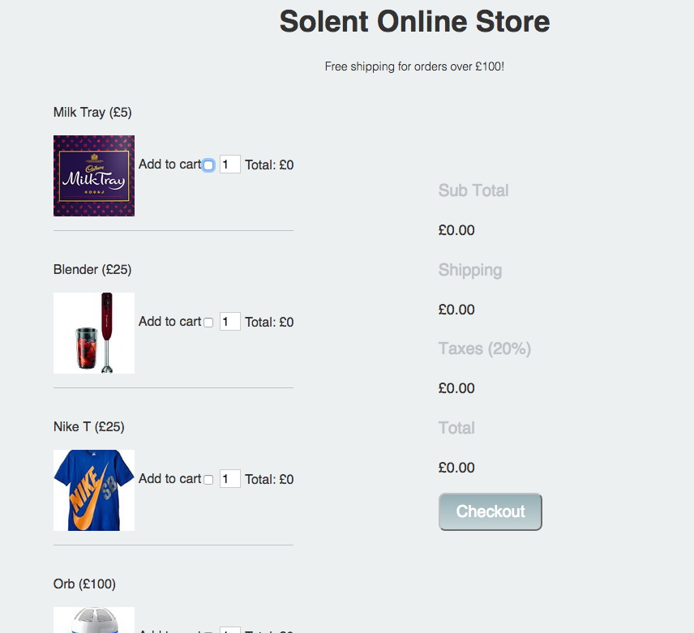

# Practical 


## Task 1 - JavaScript Guessing Game


**Set Up** 

1) Within a new folder create the following files:

	- js/main.js 
	- index.html
2) Within `main.js` create a function called `main`, for now it will just have one line of code in it `alert('working')`

3) Within `index.html`s body tag, add a inline load even that calls the function `main`.   `<body onload="main">`


### Main Task 

The aim of the task this week is to create a number guessing game. Your program will generate a number between a user defined range. The user will then make guesses with the aim of finding that number. Feedback will be given on if the guess is:

- Smaller than the number
- Larger than the number 
- An exact match! 

1) Add the following elements to `index.html` and give them `id`'s where appropriate:


- An input and label for the guess 
- A `<button>Click Me </button>` that will be pressed after the guess 
- A paragraph to hold the result 


2) At the top of your javascript file create vars to hold the following values: 
	
	- random_number 
	- number_of_guesses
	
3) `Math.round(Math.random() * (20 - 10) + 10);`  generates a random number between 20 and 10. The formula looks like this `Math.round(Math.random() * (max - min) + min);`.  Create a function `getRandomArbitrary(min, max)` which returns a random number between any given range.  


4) Set `random_number` equal to a random number by using the above function. This should be done in `main()` which is called when the page has loaded
 
5) Using **external javescript** add a click event to the button that runs a guess function. 

6) Write the guess function, it should grab the the [user input](./notes_practical.html#the-document-object-accessing-html) and run some comparisons and adjust the `inner_html` value of your paragraph to display the information based on the guess. 

7) **Advanced** set up a variable called `var number_of_guesses = 10`, decrement this variable on each guess. If the user runs out of guesses it's game over. The inputs should then be hidden. 


## Task 2 - Solent Stores

### Solent Stores - Shopping cart exercise

The purpose of this exercise is to extend/improve/finish the solent stores exercise from last week. Once this is done, please work on your assignment

### 1 Setup

[Download the project source file from here](https://learn.solent.ac.uk/pluginfile.php/1608307/mod_resource/content/1/shopping_cart_exercise.zip?forcedownload=1#).  Open up index.html in your browser, you should be presented with the following website:



### 2  Add a data attribute to hold the price of each product

If you take a look at your source code for index.html you'll see that each product has a checkbox for the add to cart functionality.  Heres the one for our blender:

```html
    <input type="checkbox" name="product" value="blender">
```

[At the a data attribute to hold the ](https://sirus21.gitbooks.io/internet_technology_block_2/content/session17/enconding_information_into_elements.html) of each item. For example, our blender input would become:

```html
     <input type="checkbox" name="product" data-price = "25" value="blender">
```

### 3 Our first bit of javaScript

Within index.html, notice how we've included an external javaScript file and also added a `onLoad` event that calls a `main()` function.

1. Open up `script/main.js` 
2. Within `main.js` add an event listener that fires the `formChangedFunction`
3. Check that the message is output to the console when the form changes

### 4 Working out the main totals and shipping costs

1. Within `main.js` `formChangeFunction` create the following variables:

```javascript
    var form = document.getElementById("productForm"); 
    var subTotal = 0;
    var shipping = 0;
    var taxes = 0;
    var total = 0;
```

1. Next, within `formChangedFunction` Create a for loop that loops through the `product` check list, if a product has been checked you should cast the `price` to a number and add it to the subtotal. This is very similar to our the example in the notes.  

```javascript
    numberTotal =  parseInt(form.product[i].dataset.price);
    subTotal = subTotal +  numberTotal;
```

> > how to access the price from within the loop

Note, this is very similar to the in class example.

1. After the loop, check to see if the `subTotal` is less than £100. If this is the case, set `shipping = £10`  
2. Set the variable `taxes =  20% of subTotal`
3. Set the variable `total = subTotal + taxes + shipping`
4. Set the inner HTML of each section in the summary table = to your new variable values:

```javascript
document.getElementById("sub-total").innerHTML =  "£" + subTotal;
document.getElementById("shipping").innerHTML =  "£" + shipping;
document.getElementById("taxes").innerHTML =  "£" + taxes;
document.getElementById("total").innerHTML = "£" + total;
```

```
5 Product totals and multiple items
```

Implement the functionality to allow the amount of each product to be increased. The total for each product should be displayed.   This is tricky, but let's take the blender as an example and consider its related elements:

```html
<input data-price="25" type="checkbox" name="product" value="blender">  
<input type="number"  value="1" name="blender-quantity"> 
<p>Total: <span  id="blender-total"> £0 </span> </p>
```

This naming convention is consistent for all the products, your solution will take advantage of this.

### 6 Add real time form validation

The quantity box should go red if a number is entered below 0 or above 100.


### 7 Add a order summary

Above the checkout button add a order summary. This should be a list of items that have been selected in human readable form. It should be updated in real-time. To achieve this you'll need to add a desc attribute to each of you of your check boxes:


    ```<input type="checkbox" name="product" data-desc="Milk Tray" value="mt">```


